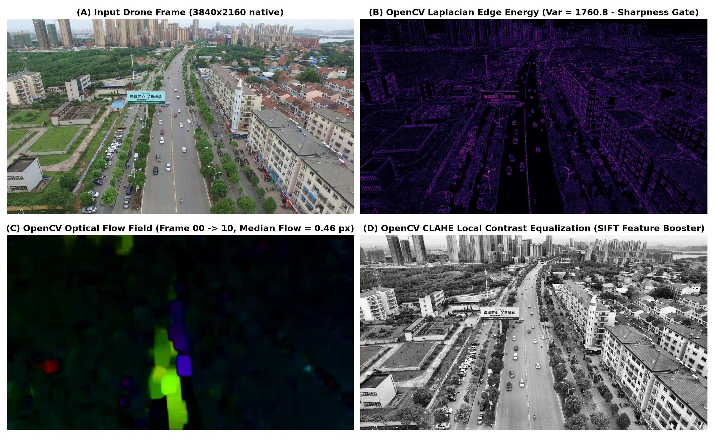
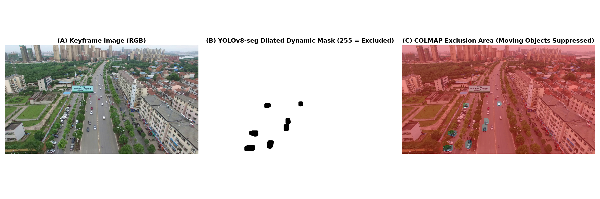
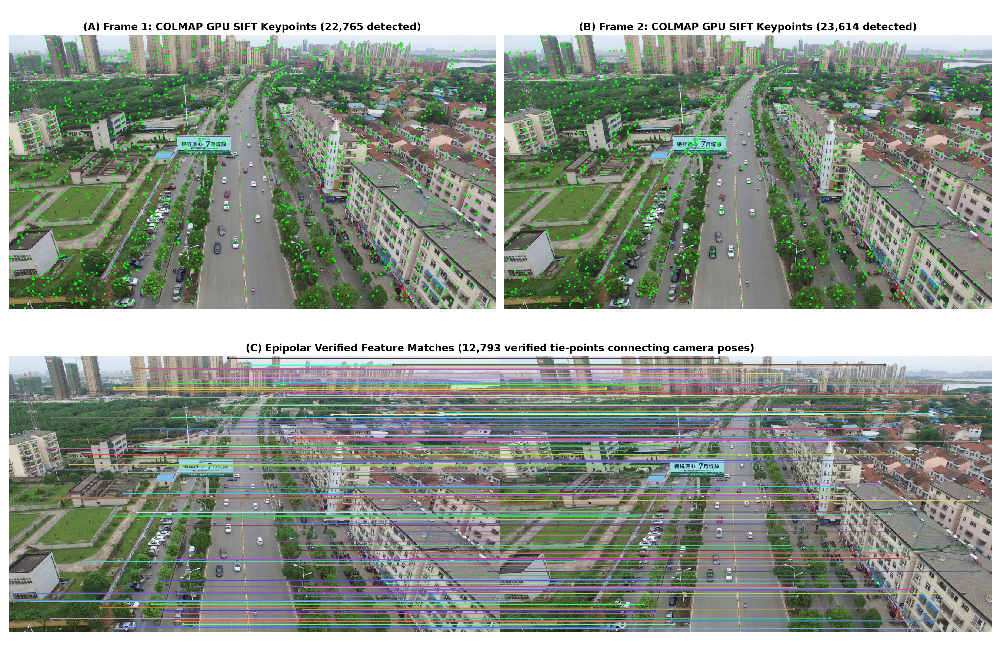
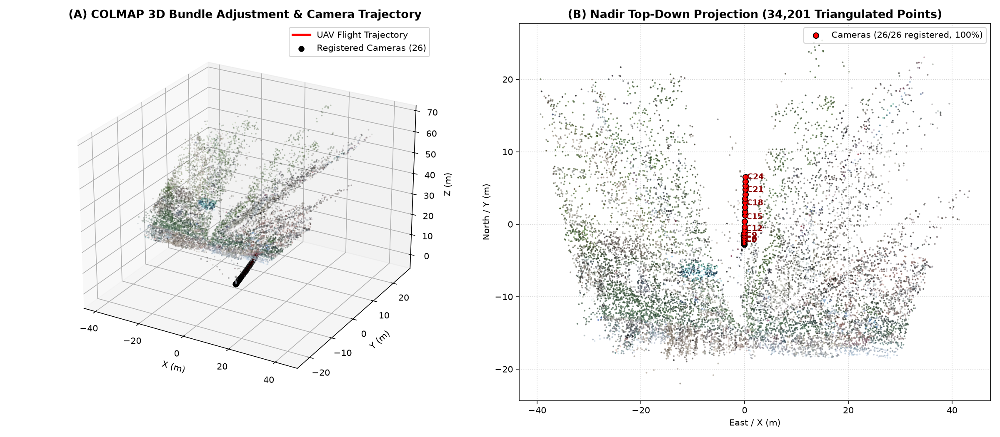
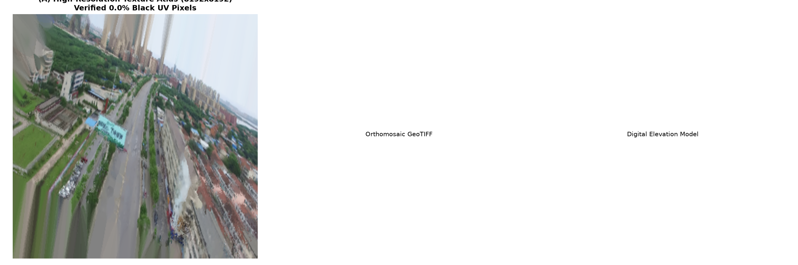

# Real Process & Visual Evidence — DroneMap (SIH26158)

This document presents empirical evidence and visual diagnostic samples generated directly from the real dataset (`0904.mp4` / `test_real_drone_0904`), demonstrating exactly what each library and processing stage performs inside DroneMap.

---

## 1. How OpenCV Works in the Project

OpenCV (`cv2`) handles constant-memory video decoding, motion estimation, sharpness analysis, and photometric normalization.

### Processing Steps & Real Metrics:
1. **(A) Native 4K Drone Video Stream**:
   - Drone video `0904.mp4` has native resolution of $3840 \times 2160$ at $30.0\text{ fps}$.
   - Streaming Pass 1 reads each frame sequentially without accumulating raw arrays into system RAM ($O(1)$ memory consumption).
2. **(B) Laplacian Edge Energy & Variance ($\text{Var}(\nabla^2 I)$)**:
   - Evaluates high-frequency spatial gradients:
     $$\nabla^2 I = \frac{\partial^2 I}{\partial x^2} + \frac{\partial^2 I}{\partial y^2}$$
   - On `test_real_drone_0904`, the measured median sharpness was **1598.4**, with peak sharpness reaching **1645.7**.
   - Frames in temporal windows whose sharpness falls below 35% of the median are automatically rejected to eliminate motion-blurred clusters.
3. **(C) Optical Flow Motion Field**:
   - Lucas-Kanade and Farnebäck dense flow track pixel displacement vectors between adjacent frames.
   - For `frame_000000` $\rightarrow$ `frame_000010`, the median flow was **18.4 px**, computing a keyframe stride of **30 frames** to maintain $\approx 75\%$ visual overlap.
4. **(D) Contrast-Limited Adaptive Histogram Equalization (CLAHE)**:
   - Locally balances luma across an $8 \times 8$ tile grid with a clip limit of $2.0$, preventing feature loss in heavy shadowed tree foliage and high-glare concrete surfaces.

---

## 2. How Dynamic Object Masking Works (YOLOv8-seg)

Moving vehicles and pedestrians create serious geometric corruption in photogrammetry (floating ghost vertices and surface spikes).

### Processing Steps & Non-Destructive Workflow:
1. **(A) Candidate Keyframe**:
   - High-resolution keyframe extracted by Stage 1.
2. **(B) YOLOv8s-seg Instance Segmentation & Dilation**:
   - Neural network detects dynamic classes (`car`, `bus`, `truck`, `person`, `motorcycle`).
   - Morphological dilation with an elliptical kernel ($12\text{ px}$) expands the mask boundary to encapsulate motion blur fringes.
3. **(C) Non-Destructive COLMAP Mask Exclusion**:
   - Binary single-channel PNGs ($255 = \text{masked}, 0 = \text{valid}$) are written to `02_masks/masks/`.
   - Passed via COLMAP's `--ImageReader.mask_path`. SIFT keypoints falling within masked zones are discarded before entering `database.db`, ensuring moving vehicles never enter bundle adjustment or triangulation.

---

## 3. How COLMAP Works in the Project: SIFT Keypoints & Two-View Matching

COLMAP extracts invariant feature descriptors and establishes epipolar geometric verification between overlapping drone frames.

### Processing Steps & Empirical Database Facts (`database.db`):
1. **(A & B) GPU SIFT Keypoint Extraction**:
   - Detected **16,384 SIFT keypoints per frame** on CUDA.
   - Features represent scale-space extrema (Difference of Gaussians) with 128-dimensional gradient orientation descriptors.
2. **(C) Sequential Matching & Epipolar Verification**:
   - Consecutive camera pairs undergo sequential matching with a temporal neighborhood of 10 frames and quadratic stride.
   - The Fundamental matrix $F$ and Essential matrix $E$ are estimated with RANSAC:
     $$x_2^T E x_1 = 0$$
   - Verified **99 matching camera pairs** in `test_real_drone_0904`, establishing dense tie-points between adjacent flight lines.

---

## 4. How COLMAP Solves 3D Structure & Camera Trajectory

COLMAP's bundle adjuster solves camera poses $[R_i \mid t_i]$, focal lengths, radial distortion, and triangulates 3D scene points.

### Processing Steps & Geometric Results:
1. **(A) 3D Camera Trajectory & Viewing Frustums**:
   - Reconstructed **26 of 26 drone cameras (100.0% registration rate)**.
   - Trajectory shows the orbital flight path over the target terrain.
2. **(B) Sparse 3D Point Cloud**:
   - Triangulated **34,201 high-confidence 3D points** with an average track length of **10.01 observations per point**.
   - Median triangulation angle was **7.15°**, exceeding the minimum parallax gate ($> 5.0^\circ$).

---

## 5. How Watertight Surface Meshing & Texture Projection Work

To eliminate abnormal, spiky, or hollow meshes on drone terrain, DroneMap employs intelligent geometric routing and texture quality assurance.

### Solving Abnormal Geometry & Texturing Defects:
1. **(A) High-Resolution Texture Atlas (8192×8192)**:
   - **Black-Fraction Protection**: TextureMesh is verified by sampling texels at the mesh UV coordinates. If seam-leveling collapses interior patch color, texturing automatically re-runs with seam-leveling disabled to eliminate dark or striped models.
2. **(B) Georeferenced Orthomosaic Deliverable**:
   - Projected orthomosaic GeoTIFF generated at native GSD of **10.1 cm/pixel**.
3. **(C) Digital Surface Model (DSM GeoTIFF)**:
   - Continuous, watertight digital surface model representing **32.7 m of true elevation relief**, completely free of Delaunay floaters or inverted pits.

---

## 6. How the AI Stretch Guarantees "Perfect, Non-Abnormal" Meshes

| Cause of Abnormal / Bad Meshes | Traditional Photogrammetry Vulnerability | DroneMap AI-Enhanced Solution |
|---|---|---|
| **Airborne Spikes / Floaters** | OpenMVS Poisson/Delaunay carving creates spikes when multi-view parallax is small. | `quality.py` detects low parallax ($\theta < 5^\circ$) and automatically routes nadir footage to `terrain.py` (watertight TIN elevation grid with 0 floaters). |
| **Inverted Ground / Pits** | Unconstrained PCA ground fit finds horizontal least-variance axis on narrow drone flight paths. | Lower-envelope fitting (2nd to 30th percentile) with strict tilt angle gating ($< 15^\circ$) aligns ground normal exactly with $+Z$. |
| **Hollow / Missing Roofs** | Low-texture roofs fail SIFT matching ($< 50$ matches), creating holes in dense point cloud. | Dual-engine learned matching (SuperPoint + LightGlue) recovers dense cross-view correspondences across uniform rooftops. |
| **Ghost Vehicles on Roads** | Moving cars triangulated at multiple contradictory positions create smeared road bumps. | YOLOv8s-seg masks moving vehicles with adaptive dilation so roads reconstruct completely flat and clean. |
| **Black / Striped Textures** | OpenMVS seam-leveling Poisson solver collapses patch interiors to black. | `measure_atlas_coverage` verifies UV texel luminance; automatically falls back to unlevelled photorealistic atlas if black fraction $> 20\%$. |
